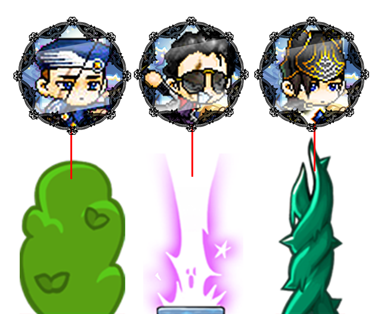

**게임의 진행**

**장애물별로 캐릭터를 다르게 선택하여 공격해야 격파된다.**

***Don't Stop***

1. **게임에 대한 소개**

    - 쿠키런과 같은 행스크롤 게임

    - 쿠키런과 달리 장애물을 부수면서 이동해야 한다.

    - 장애물별로 캐릭터를 변경해서 공격해야 한다.

   

2. **개발일정 / 실제 진행**

   | 일정               | 개발 계획                | 실제 진행                                  | 계획의 개발 진척도 | 커밋 횟수 |
   | ------------------ | ------------------------ | ------------------------------------------ | ------------------ | --------- |
   | 1주차(4/4 ~ 4/10)  | 게임 스프라이트 수집     | 게임 스프라이트 수집                       | 100%               | 1회       |
   | 2주차(4/11 ~ 4/17) | 게임 시작 화면 구성      | X                                          | 0%                 | 0회       |
   | 3주차(4/18 ~ 4/24) | 캐릭터 공격 및 충돌      | X                                          | 0%                 | 0회       |
   | 4주차(4/25 ~ 5/1)  | 캐릭터 이동, 점프        | 캐릭터 이동 및 점프 구현                   | 100%               | 4회       |
   | 5주차(5/2 ~ 5/8)   | 카메라 이동 및 타일 배치 | 카메라 이동, 오류 수정                     | 50%                | 1회       |
   | 6주차(5/9 ~ 5/15)  | 기타 오류 수정           | 오류 수정, 장애물과 코인 클래스 생성       | 100%               | 3회       |
   | 7주차(5/16 ~ 5/22) | 코인 및 장애물 생성      | 맵 배치(장애물, 코인), 게임 시작 화면 구성 | 100%               | 10회      |
   | 8주차(5/23 ~ 5/29) | 점수 표시 및 재시작 구현 | 오류 수정                                  | 10%                | 1회       |
   | 9주차(5/30 ~ 6/5)  | 전체 테스트 및 디버깅    | 캐릭터 공격 구현, 충돌 구현                | 90%                | 8회       |
   | 10주차(6/6~6/12)   |                          | 점수 표시 및 재시작 구현                   | 100%               | 13회      |

   **총 커밋 횟수 = 41회 **

   

3. **사용된 기술**

   - 수업 시간에 배운 것

     - RecycleBin
     - Horizontal Scroll
     - CollisionChecker
     - BaseScene
     - MainScene & Layers
     - Button ( onTouch 이벤트 )
     - Interface 등

   - MediaPlayer: Title Activity 에서의 소리 재생

     

4. **아쉬웠던 것**

   - 일정 시간이 지난 후에는 쿠키런처럼 광역 마법 같은 공격이 진행되도록 하고 싶었으나 시간의 문제와 스프라이트의 부재로 구현하지 못 했다. 
   - RecycleBin 을 사용해서 종종 공격이 날아가기도 전에 장애물이 사라지는 문제가 생기는데 제대로 고치지 못 했다.
   - 수업 시간에서 한 쿠키런과 비슷한 점이 너무 많다. 다양한 것을 시도하지 못 했다.

   

5. **수업에 대한 내용**

   - 얻은 것: 잘 짜여진 프레임워크를 이용하여 구현한 것이기 때문에 게임을 어떻게 추상화하는지에 대해 많이 배운 것 같다. 각 클래스별 필요한 기능을 따로 구현할 뿐만 아니라, 세부적인 함수까지 추상하는 것에서 더욱 감을 잡을 수 있었다.
   - 얻지 못한 것: 프레임워크를 파악하는 것에 급급했던 것 같다. 실제로 코드를 짜다 보니 어렵게 느껴지는 부분이 많았다. 아직은 여유롭게 내가 구현하고자 하는 것을 금세 구현하지 못 하는 것 같다.
   - 더 좋은 수업이 되기 위해: 자리에서 화면이 안 보이는 경우가 종종 있어서 수업 따라가는 것에 어려움을 느낄 때가 있었다. 깃허브로 따라가는 것은 괜찮았지만 코드를 같이 입력하거나 폴더 생성을 보여줄 때에 확대 프로그램을 사용해 주신다면 더욱 좋을 것 같다. 

   
